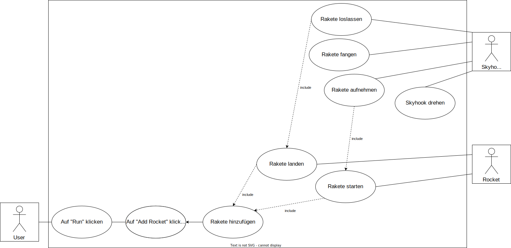

# Skyhook Simulation
Simulation and Project details  

##Generelle Informationen##
Unser Projekt umfasst eine Simulation, die einen Skyhook aufbau darstellen sollte. Es sollte möglich sein, eine _Rocket_ per Klickdruck zu ereugen, welche dann von der Erde aus startet, vom _Skyhook Earth_ aufgenommen wird und zum _Skyhook Mars_ geschleudert wird. Dort wird sie gefangen und beim tiefsten punkt zum _Mars_ losgelassen. Dort landet die _Rocket_ und verschwindet. Nach 5 Sekunden sollte die _Rocket_ wieder Starten und das gleiche in die andere Richtung tun. 

Die Anforderungsdefinition ist in [M226b\_Anforderung\_Doku_V1.2.docx](./M226b\_Anforderung\_Doku_V1.2.docx) zu finden.

##Anleitung##
1.	Projekt von GitHub klonen: `git clone https://github.com/daenzg/skyhook_sim.git`
2.	[Project.greenfoot] (./Greenfoot/skyhook_sim/project.greenfoot) öffnen.
3.	Auf "Run" klicken.
4.	Auf Knopf mit Rakete klicken, um Rakete hinzuzufügen.
5.	Beobachten.

##Modelle##
###1. Funktionsmodell###

---
###2. Anwendunsfalldiagramm###

---
###3. Storyboard###

---
###4. Klassendiagramm###

---
###5. Sequenzdiagramm###

##Entwickler##
|	Person				| Kontakt				             |
|:------------------|:-------------------------------|
|Sebastian Müller 	| <sebastian.mueller@edu.tbz.ch> |
|Marc Geiger 			| <marc.geiger@edu.tbz.ch>       |
|Daniel Furrer 		| <daniel.furrer@edu.tbz.ch>     |